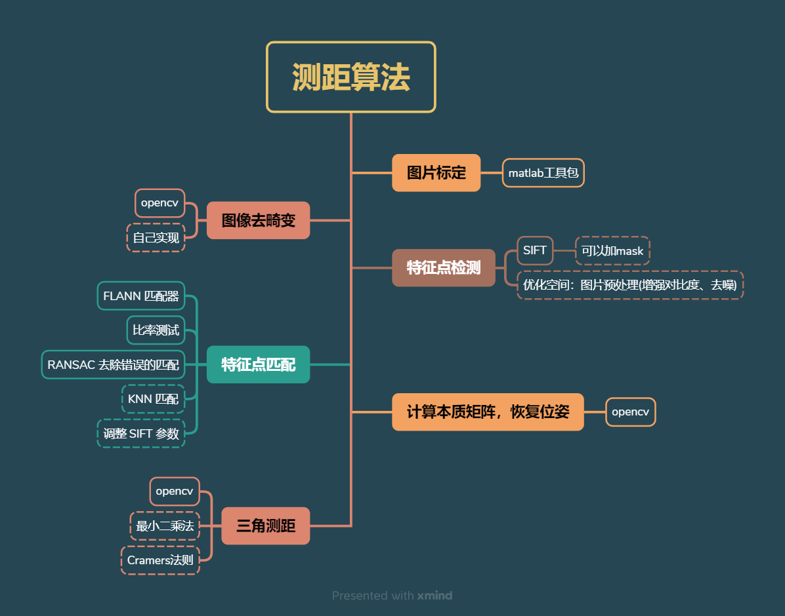

# Monocular-camera-measurement-distance-algorithm
Monocular camera measurement distance algorithm：Using a simple camera, by calibrating the internal parameters in advance, a simple monocular ranging is achieved using the API provided by opencv.

## Notice
CMakeLists.txt is directly generated with tools, so there may be problems, the source file only uses the OpenCV API, so you can directly configure the environment by yourself and run it with code.  
The source code of the code draws on the "Fourteen Lectures on SLAM" to realize image dedistortion-> feature point detection-> feature point matching-> calculation of the essence matrix, recovery camera pose, and > triangulation ranging.  
There are some other implementation methods in the flowchart, if you are interested, you can try it yourself, the current ranging effect is not ideal, and then improve it.

## 小提示
CMakeLists.txt是直接用工具生成的，所以可能有问题，源文件只使用了OpenCV的API，所以可以直接自己配置环境，用代码运行。 
代码源码借鉴了《SLAM十四讲》，实现图片去畸变->特征点检测->特征点匹配->计算本质矩阵恢复相机位姿->三角测距。 
流程图中有一些其他的实现方法，有兴趣可以自行尝试，目前的测距效果不太理想，之后再改进。

